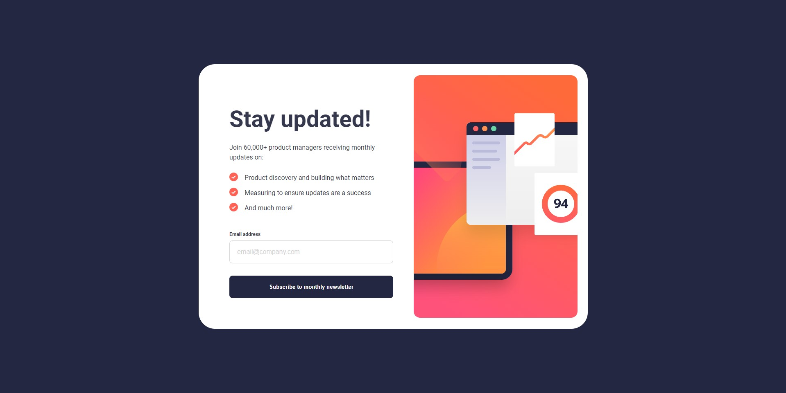
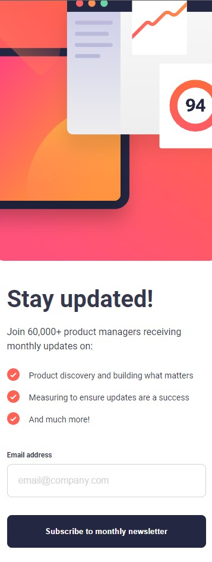

# Frontend Mentor - Newsletter sign-up form with success message

## The challenge

Your challenge is to build out this newsletter form and get it looking as close to the design as possible.

You can use any tools you like to help you complete the challenge. So if you've got something you'd like to practice, feel free to give it a go.

Your users should be able to:

- Add their email and submit the form
- See a success message with their email after successfully submitting the form
- See form validation messages if:
  - The field is left empty
  - The email address is not formatted correctly
- View the optimal layout for the interface depending on their device's screen size
- See hover and focus states for all interactive elements on the page

## Table of contents

- [The challenge](#the-challenge)
- [Screenshot](#screenshot)
- [Links](#links)
- [Built with](#built-with)
- [Author](#author)

### Screenshot

### Links

- Solution URL: [Repository](https://github.com/marllonlaborne/newsletter-sign-up)

### Built with

- HTML5
- CSS3
- JavaScript

### Author

- Website - [Marllon Laborne Lima](https://beacons.ai/marllonlaborne)
- Frontend Mentor - [@marllonlaborne](https://www.frontendmentor.io/profile/marllonlaborne)
- Github - [marllonlaborne](https://github.com/marllonlaborne)
